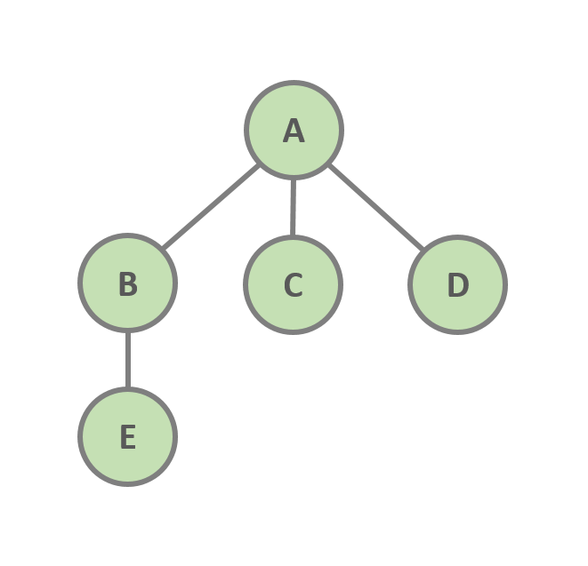
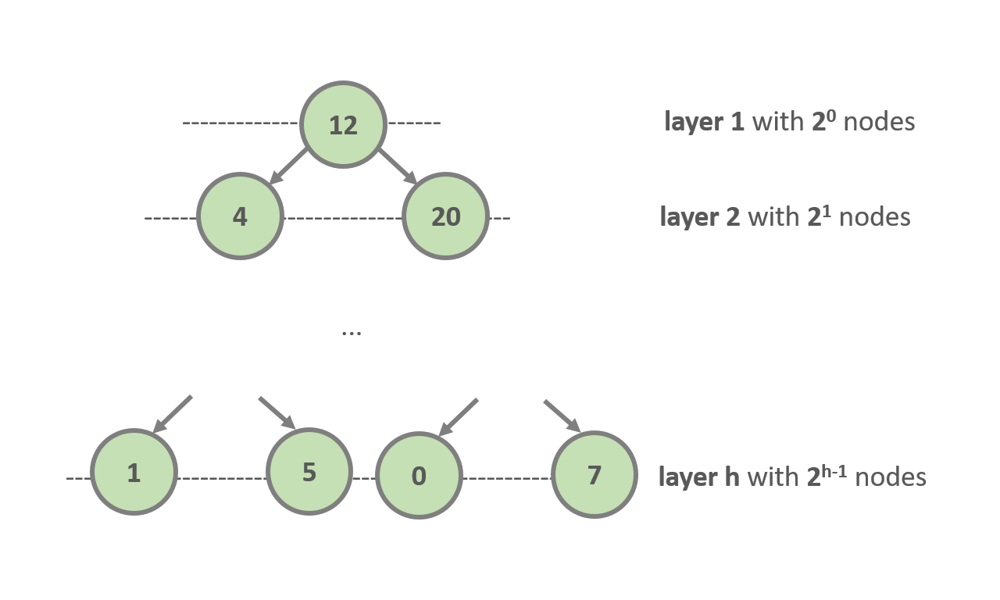

<h1 align="center">Algorithms and Data Structures</h1>
<h2 align="center">Binary Search Tree</h2>

<br><br>  
# _Table of Contents_

- [Overview](#id01)
- [Tree Definition](#id02)
- [Binary Search Tree](#id03)
- [Binary Search Tree Operations](#id04)
- [BST Implementation](#id05)

<a id='id01'></a>
# Overview

In simple data structures such as Arrays, and Linked-List the access to an arbitrary element without knowing its index takes $O(N)$ time complexity. So, the question _can we do better?_ pops.

A simple solution is to **sort** the elements, for example in the Array and use `binary search` to accomplish a time complexity of $O(logN)$, but the process of sort an array with advance algorithms takes in average $O(NlogN)$.

The purpose of a `Binary Search Tree` is to overcome this issue, maintaining the elements in the structure some how ordered -following some criteria in the arrangement. And apply binary search in the structure that allow us the access to arbitrary elements (_having access exclusively to the **root node**_) in $O(logN)$.

<a id='id02'></a>
# Tree Definition

A `Tree` is a $G(V,E)$ undirected graph in which any two vertices are connected by exactly **one path**, namely an **acyclic undirected path**. All vertices with no connections (no children at all) are called `leaf nodes`.

<br>
<p align="center">

<br>
<i>Tree representation: A is the root node. C, D, E are  leaf nodes. B, C, D are childs of A. B is parent of E.</i>
</p>
<br>

<a id='id03'></a>
# Binary Search Tree

The properties of a Binary Search Tree are:
- Every node in the tree can have **at most 2 children** (`left child` and `right child`).
- `left child` is smaller than the parent node.
- `right child` is greater than the parent node.
- we can access the `root node` exclusively and all other nodes can be accessed via the `root node`.
- The **height of a tree** $h$, is the number of edges on the longest downward path between the `root` and a `leaf node`, namely the number of layers that the tree contains.

<br>
<p align="center">

<br>
<i>Complete Binary Search Tree with h height</i>
</p>
<br>

## Balanced and Imbalanced Trees

We must notice that a complete BST with height $h$ it has $2^{h-1} = N$ nodes, so:   
$log_2 2^{h-1} = log_2 N$  
$h = log_2 N + 1$  
$h = O(logN)$

That means, logarithmic running time complexity $O(logN)$ is valid only **when the tree structure is balanced**, namely we should keep the height of a tree at a minimum, which is $h = log_2N$

<a id='id04'></a>
# Binary Search Tree Operations

- `Insert an Item`: In order to keep the elements ordered we need to consider the property of `left` or `right`. That means, we need to check if the element that we want to insert is _greater that the current element_ and continue to the `right` of the tree if the condition is true or continue to the `left` if the value is _less that the current element_.

- `Search for an Item`: To search for an element in the tree, we follow the same aproach used for insertion.

- `Get Max Item`: Following the properties of a `Binary Search Tree` we are able to keep our elements ordered, so we know that the _most right_ element in the tree is the maximum value, then to get this value we need to traverse the tree to the right side until reach a `leaf node`.

- `Get Min Item`: Following the properties of a `Binary Search Tree` we are able to keep our elements ordered, so we know that the _most left_ element in the tree is the minimum value, then to get this value we need to traverse the tree to the left side until reach a `leaf node`.

- `Delete an Item`: To remove an element we can face **three scenarios:**.  
1.- Remove a `leaf node`: This is the simple case. We first search for the element and once we found it, we need to notify the parend node (_making the parent points to Null_), so we can remove the element.   
2.- Remove an element with a `single child`: We first search for the element and check if it has child nodes. If it has one child node, we need to notify to the current's node parent and link the current's child node to the current's parent node to the same side.  
3.- Remove an element with `two childs`: This is the most complex scenario. To deal with we need to establish a convention. Which node we will to use, the `predecessor` or the `sucessor`?  
The predecessor is the node with the **maximum** value in the `left` tree.  
The sucessor is the node with the **minimum** value is the `right` tree.  
Once we establish our strategy we can remove the item. We will say that we can use the `predecessor`, so once we found the item that we want to remove, we continue searching for the maximum value in the left node and then swap it with the item that we want to remove. After that, we will deal with a `leaf node` and apply the case number #1 (_mathematical reduction_).

- `Tree Traversal`: Tree Traversal means vsit every node in the Binary Search Tree exactly once. This operation runs in $O(N)$ running time complexity.  
There are 3 types of traversal:  
a) Pre-Order Traversal: Visit the `root node` of the binary tree then the `left subtree` and finally the `right subtree` in a recursive manner.  
b) In-Order Traversal: Visit the `left subtree` of the binary tree then the `root node` and finally the `right subtree` in a recursive manner.  
c) Post-Order Traversal: Visit the `left subtree` of the binary tree then the `right subtree` and finally the `root node` in a recursive manner.   
All of them relay in the use of `recursion`.  
Because `In-Order` returns the values of the tree sorted, it is the most crucial.

<br>
<h2 align="center">Binary Tree Complexity</h2>
<p align="center">

|             |Average Case|Worse Case|
|:-----------:|:----------:|:--------:|
|Space:       | $O(N)$     | $O(N)$   |
|Insert:      | $O(logN)$  | $O(N)$   |
|Search:      | $O(logN)$  | $O(N)$   |
|Delete:      | $O(logN)$  | $O(N)$   |
|Traverse:    | $O(N)$     | $O(N)$   |

_**NB: worse case refers to imbalanced tree case**_
</p>
<br>

<a id='id05'></a>
# BST Implementation

```python
class Node:
    '''single node representation'''
    def __init__(self, value, parent=None):
        self.value = value
        self.left = None
        self.right = None
        self.parent = parent


class BinarySearchTree:

    def __init__(self):
        self.root = None

    def insert(self, value):
        '''insert operation method'''
        # if root is none there is the first insertion
        if self.root is None:
            self.root = Node(value)
        else:
            # BST is not empty
            self.insert_node(value, self.root)

    def insert_node(data, node):
        '''internal method which insert new node recursively'''
        if data < node.value:
            # we check the left subtree
            if node.left is not None:
                # the current node has a left child
                # then we continue traversing the tree
                node.insert_node(data, node.left)
            else:
                # we reach a leaf node so we insert the new one
                node.left = Node(data, node)
        else:
            # we check the right subtree
            if node.right is not None:
                # the current node has a right child
                # then we continue traversing the tree
                node.insert_node(data, node.right)
            else:
                # we reach a leaf node so we insert the new one
                node.right = Node(data, node)

    def delete(self, value):
        if self.root  is not None:
            self.remove_node(value, self.root)

    def remove_node(self, data, node):
        '''remove recursively the node, where node.value = data'''
        # base case
        if node is None:
            return
        # 1. search for the node to be removed
        if data < node.value:
            node.remove_node(data, node.left)
        elif data > node.value:
            node.remove_node(data, node.right)
        else:
            # we found the node
            # case 1: we are dealing with a leaf node
            


    def get_min(self):
        '''return the minimum value in the BST'''
        if self.root is not None:
            return self.get_min_value(self.root)

    def get_min_value(self, node):
        '''get the left most node in the BST recursively'''
        if node.left is not None:
            return node.get_min_value(node.left)
        else:
            return node.value

    def get_max(self):
        '''return the maximun value in the BST'''
        if self.root is not None:
            return self.get_max_value(self.root)

    def get_max_value(self, node):
        '''get the right most node in the BST recursively'''
        if node.right is not None:
            return node.get_max_value(node.right)
        else:
            return node.value

    def traverse(self):
        '''treaverse the BST'''
        if self.root is not None:
            return self.traverse_in_order(self.root)

    def traverse_in_order(self, node):
        '''BST In-Order traversal recursively
        in-order: left subtree > root > right subtree
        '''
        # we start at the left subtree (calling it until reach a leaf node)
        if node.left is not None:
            node.traverse_in_order(node.left)
        # oncce we reach a leaf node we print the value
        # notice that left > root > right refers to three nodes
        # left child - parent - right child, where parent = root
        print(node.value)
        # we continue with the right subtree (calling it until reach a leaf node)
        if node.right is not None:
            node.traverse_in_order(node.right)

