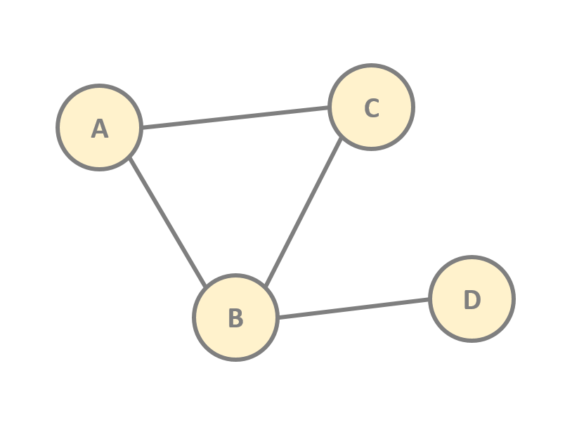
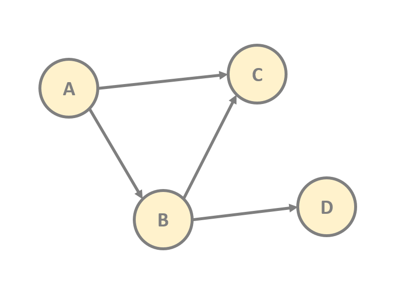

<h1 align="center">Algorithms and Data Structures</h1>
<h2 align="center">Graph Traversal</h2>

<br><br>  
# _Table of Contents_

- [Overview](#id01)
- [Breadth First Search (BSF)](#id02)
- [BFS Implementation](#id03)
- [Depth First Search (DSF)](#id04)
- [DFS Implementation](#id05)

<a id='id01'></a>
# Overview
A graph is a mathematical structure used to model pairwise relations between objects and is defined as: $G(V,E)$ where graph `G` is made up of `V` nodes (_vertices_) that are connected by `E` edges (_links_).

There are two main types of graphs:
- `Undirected Graphs`: An undirected graph $G(V,E)$ is a set of vertices and edges where the edges are **bidirectional**. It means that edge $(u,v)$ is identical to the edge $(v,u)$.

<br>
<p align="center">

<br>
<i>Note: The edges may have weights</i>
</p>
<br>

- `Directed Graphs`: A directed graph $G(V,E)$ is a set of vertices and edges where the edges have direction. It means that for every directed edge $(u,v)$ $u$ comes before $v$.

<br>
<p align="center">

<br>
<i>Note: The edges may have weights</i>
</p>
<br>

As a basic operation in the graph is traverse the graph, namely we want to visit every vertex exactly once. To aim this goal there are two main ways to traverse the graph:
- `Breadth First Search` which visit every node **layer** by **layer**.
- `Depth First Search` which visit every node in a single path from **top** to **bottom**.

It most be notice that the main difference between both algorithms is the underlying data structure. Breadth First Search use a `Queue` which follows the FIFO principle (_First-In-First-Out_) and Depth First Search use a `Stack` which follows the principle LIFO (_Last-In-First-Out_).

<a id='id02'></a>
# Breadth First Search (BFS)
The algorith starts at the vertex defined and then checking for its neighbors which are put them into the queue and mark the vertex as _"visited"_. The algorith pops the next vertex from the queue and repeat the process. Once the queue is empty, the algorithm stops, being able to traverse the whole graph.

<br>
<h2 align="center">Breadth First Search Complexity</h2>
<p align="center">

|             |            |          |
|:-----------:|:----------:|:---------|
|Space:       | $O(V)$     | Stores all references in a layer |
|Time:        | $O(V+E)$   |   |
|             |            |   |

</p>
<br>

<a id='id03'></a>
# BFS Implementation

```python
from collections import deque

class Node:

    def __init__(self, name):
        self.name = name
        self.neighbors = []
        self.visited = False

def breadth_first_search(start):
    '''visit all nodes in the graph from start node'''
    # define the queue data structure and insert the start node
    queue = deque([start])
    start.visited = True

    # we iterate thru the graph until queue is empty
    while queue:
        # remove and return the first node we inserted in the queue
        current_node = queue.popleft()

        print(current_node.name)
        # we insert its neighbors into the queue
        for neighbor in current_node.neighbors:
            # check that node has not been visited
            if not neighbor.visited:
                # we mark the node as "visited"
                neighbor.visited = True
                # we push it into the queue
                queue.append(neighbor)

```

<a id='id04'></a>
# Depth First Search (DFS)
The algorith starts at the vertex defined and then checking for its neighbors which are put them into the stack and mark the vertex as _"visited"_. The algorith pops the next vertex from the stack and repeat the process. Once the stack is empty, the algorithm stops, being able to traverse the whole graph.

**NB: Due to DFS uses a stack the algorithm is easily implemented with _recursion_, because each call is push into the stack memory, namely the same underlying data structure is used.**

<br>
<h2 align="center">Depth First Search Complexity</h2>
<p align="center">

|             |            |          |
|:-----------:|:----------:|:---------|
|Space:       | $O(logV)$     | It has better space complexity than BFS |
|Time:        | $O(V+E)$   |   |
|             |            |   |

</p>
<br>

<a id='id05'></a>
# DFS Implementation

```python
class Node:

    def __init__(self, name):
        self.name = name
        self.neighbors = []
        self.visited = False

def depth_first_search(start):
    '''visit all nodes in the graph from start node'''
    # define the stack data structure and insert the start node
    stack = [start]
    start.visited = True

    # we iterate thru the graph until stack is empty
    while stack:
        # remove and return the last node we inserted in the stack
        current_node = stack.pop()

        print(current_node.name)
        # we insert its neighbors into the stack
        for neighbor in current_node.neighbors:
            # check that node has not been visited
            if not neighbor.visited:
                # we mark the node as "visited"
                neighbor.visited = True
                # we push it into the stack
                stack.append(neighbor)

```

```python
class Node:

    def __init__(self, name):
        self.name = name
        self.neighbors = []
        self.visited = False

# DFS recursive implementation
def depth_first_search(node):
    node.visited = True
    print(node.name)

    for neighbor in node.neighbors:
        if not neighbor.visited:
            depth_first_search(neighbor)

```
