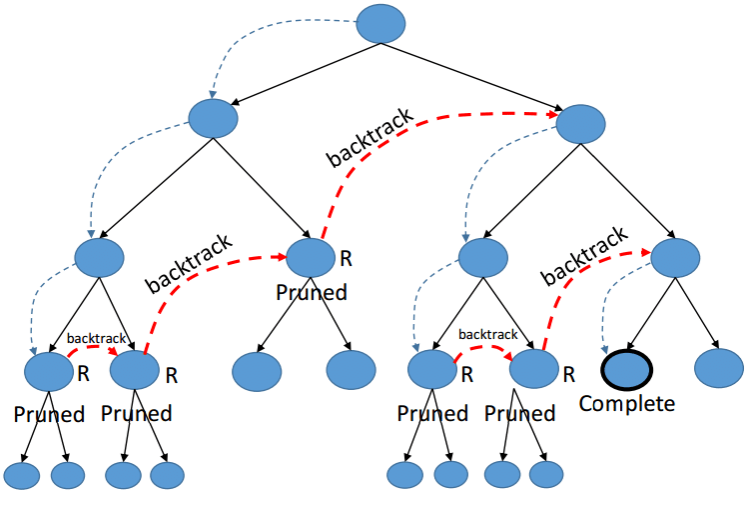
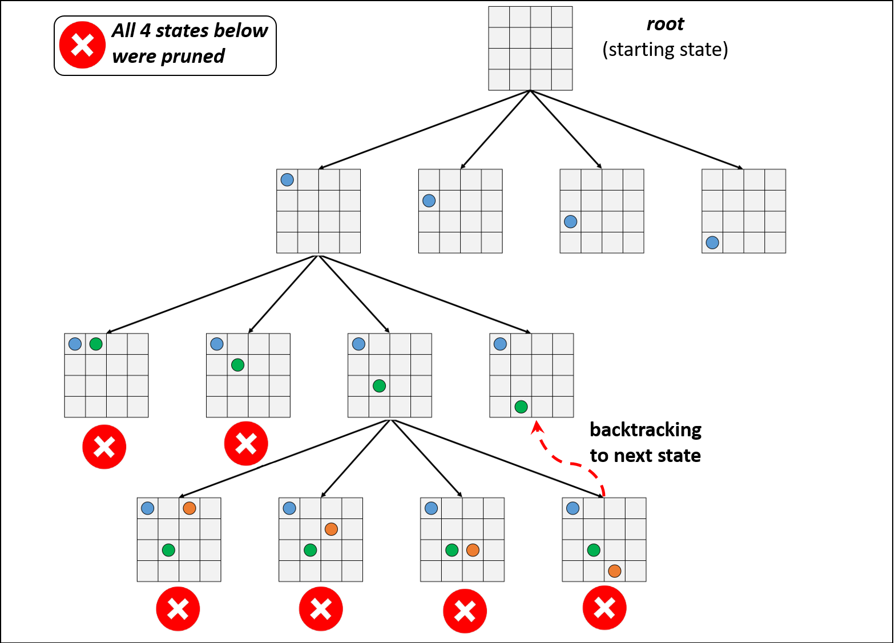
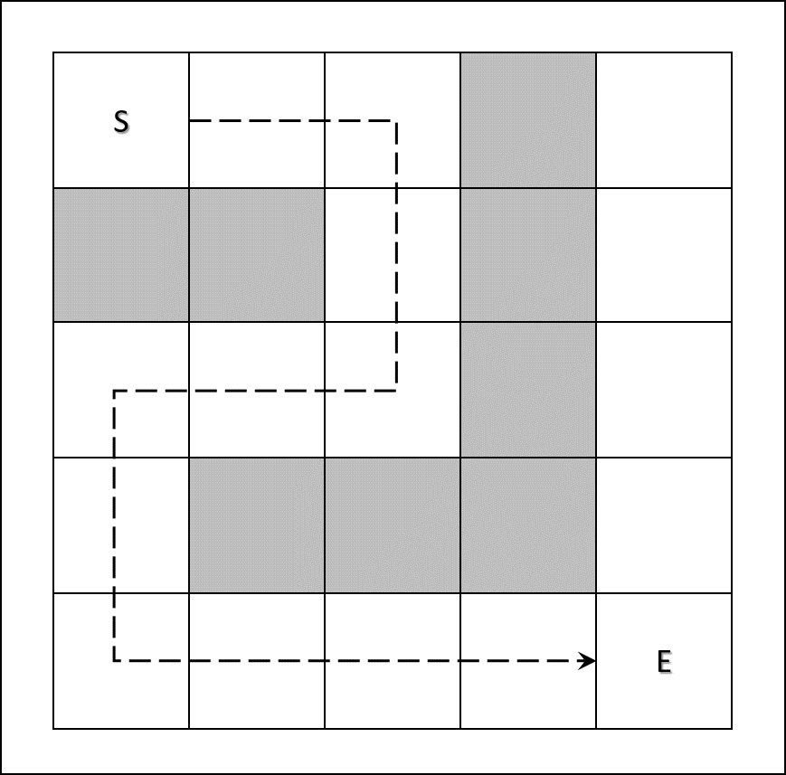
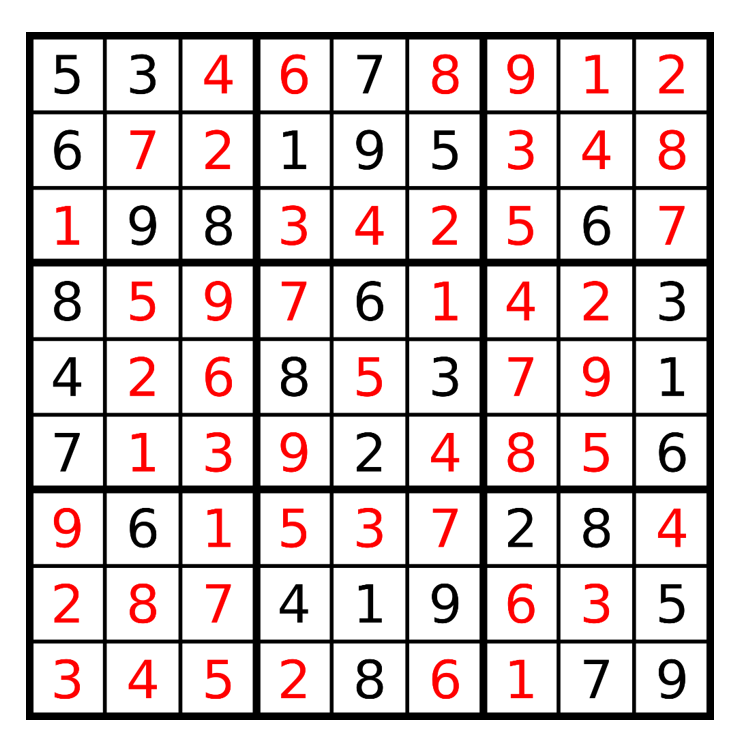

<h1 align="center">Programming Paradigms</h1>
<h2 align="center">Backtracking</h2>

<br><br>  
# _Table of Contents_

- [Overview](#id01)
- [N-Queens Problem](#id02)
- [Maze Navigation](#id03)
- [Solving Sudoku](#id04)
- [Conclusion](#id05)

<a id='id01'></a>
# Overview
_`Backtracking` is an algorithmic technique for solving problems recursively by trying to build a solution incrementally, removing those solutions that fail to satisfy the constraints of the problem at any point in time (by time, here, is referred to the time elapsed till reaching any level of the search tree)._

The idea behind the backtracking technique is that it searches for a solution to a problem among all the available options. Initially, we start the backtracking from one possible option and if the problem is solved with that selected option then we return the solution else we backtrack and select another option from the remaining available options.

There are three types of problems in backtracking:  
- Decision Problem – we search for a feasible solution.
- Optimization Problem – we search for the best solution.
- Enumeration Problem – we find all feasible solutions.

Generally, every [constraint satisfaction problem](https://en.wikipedia.org/wiki/Constraint_satisfaction_problem) which has clear and well-defined constraints on any objective solution, that incrementally builds candidate to the solution and abandons a candidate (“backtracks”) as soon as it determines that the candidate cannot possibly be completed to a valid solution, can be solved by Backtracking.

**Reference: https://www.geeksforgeeks.org/introduction-to-backtracking-data-structure-and-algorithm-tutorials/#:~:text=Backtracking%20can%20be%20defined%20as,search%20for%20a%20feasible%20solution.**

<br>
<p align="center">

<br>
<i>With the use of Backtracking we are able to discard several bad states with one iteration (prune operation). If partial candidate X cannot be completed to a valid solution then we abandon X as a solution.</i>
</p>
<br>

**NB: notice that when we are using a _tree_ like structure `Backtracking` is also called `Depth-Frist-Search` due to both algorithms traverse the tree _recursively_ from the root down.**  
<br>

<a id='id02'></a>
# N-Queens Problem
Is a problem of placing $N$ chess queens on an $NxN$ chessboard such that **no two queens** threaten each other. The original problem was designed for $N = 8$, queens.

If we want to solve the problem with a brute-force approach then we have $NxN$ cells, $N$ columns and $N$ rows, and also we have $N$ queens. So we end up with $N^N$ states. Than means $O(N!)$ running time complexity with brute-force approach.

The problem with N-Queens problem and for any `Combinatorial Optimization` related problems, is that there are an extremely huge amount of possible states to consider.

<br>
<p align="center">

<br>
<i>With the use of Backtracking we are able to discard several bad states with one iteration (prune operation). If partial candidate X cannot be completed to a valid solution then we abandon X as a solution.</i>
</p>
<br>

## _Implementation:_
Code implementation for the N-Queen problem using backtracking.
```python
# we create the chessboard for 4 Queens (4x4)
queens = 4
board = [[0 for _ in range(queens)] for _ in range(queens)]


class QueensProblem:

    def __init__(self, nqueens, board):
        self.n = nqueens
        self.board = board

    def set_queens(self):
        # if solver got a solution print it
        if self.solve(0):
            self.print_board()
        else:
            # solution is not feasible
            print(f'No feasible solution found for {self.n} Queens')

    def solve(self, column):
        # we define a base case
        if column == self.n:
            # we found a solution
            return True

        # check if each row position is valid
        for row in range(self.n):
            # check if current state is valid
            if self.is_valid(row, column):
                # set the queen on the board
                self.board[row][column] = 1
                # continue with next queen
                if self.solve(column + 1):
                    return True

                # if queen cannot be set
                # reset the chessboard and
                # backtrack and continue with next state
                self.board[row][column] = 0

        # none of the states is feasible
        return False

    def is_valid(self, row, column):
        # 1. check no other queen exist horizontally
        for x in range(column):
            if self.board[row][x] == 1:
                return False

        # 2. check diagonal top-left bottom-right
        # memorize row position on the diagonal
        r = row - 1
        for c in reversed(range(column)):
            # validate row is in range
            if r < 0:
                break

            if self.board[r][c] == 1:
                return False
            
            r -= 1

        # 3. check diagonal top-right bottom-left
        # memorize row position on the diagonal
        r = row + 1
        for c in reversed(range(column)):
            # validate row is in range
            if r >= self.n:
                break

            if self.board[r][c] == 1:
                return False

            r += 1

        return True
                
    def print_board(self):
        for row in range(self.n):
            for col in range(self.n):
                if self.board[row][col] == 1:
                    print('  Q  ', end='')
                else:
                    print('  *  ', end='')
            print('\n')
```

<a id='id03'></a>
# Maze Navigation
There are two main considerations to tackle the problem.
1. `We know the Maze in advance`. If we know the maze then we can use _havy-weight_ graph algorithms such as **Dijstras Algorithm** or **A\* Search**.
2. `We do not know the Maze`. If we don't know the maze we can use **Backtracking**.

<br>
<p align="center">

<br>
<i>The Maze is represented by a N x N matrix with an initial cell "S" at the top corner and a destination cell "E" at the bottom corner. The only movements allowed in the Maze from a single cell are Up <> Down and Left <> Right. </i>
</p>
<br>

## _Implementation:_
Code implementation for the Maze Navigation problem using backtracking.
```python
# we define the maze with the use of a two dimesional array
# 1 represents a valid cell and 0 represents an obstacle
maze = [
    [1,1,1,0,1],
    [0,0,1,0,1],
    [1,1,1,0,1],
    [1,0,0,0,1],
    [1,1,1,1,1]
]

class MazeProblem:

    def __init__(self, maze):
        self.maze = maze
        self.size = len(maze)
        self.solution = [['  *  ' for _ in range(self.size)] for _ in range(self.size)]
        # Go Right ; Go Down ; Go Left ; Go Up
        self.moves = [(1,0),(0,1),(-1,0),(0,-1)]
        # Exit is always at most bottom-right
        self.exit = (self.size - 1, self.size - 1)

    def way_out(self, start=(0,0)):
        # we start at most top-left corner by default
        x, y = start
        self.solution[x][y] = '  S  '

        if self.solve(x,y):
            # we found a solution
            self.print_maze()
        else:
            print('There is no way out of the maze!')

    def solve(self, x_coord, y_coord):
        # we define a base case
        if self.at_exit(x_coord, y_coord):
            return True

        # we navigate thru the maze
        for x, y in self.moves:
            next_x = x_coord + x
            next_y = y_coord + y

            if self.is_valid(next_x, next_y):
                # we add cell to the path
                self.solution[next_x][next_y] = '  P  '
                # we continue with next state
                if self.solve(next_x, next_y):
                    return True

                # if movement is not possible
                # backtrack and continue to next move
                self.solution[next_x][next_y] = '  *  '

        # none of the moves is feasible
        return False

    def is_valid(self, x, y):
        # 1. validate movement is inside maze bound
        if x < 0 or x >= self.size:
            return False

        if y < 0 or y >= self.size:
            return False

        # 2. validate movement doesn't go on obstacle
        if self.maze[x][y] == 0:
            return False

        # 3. validate we are not in a visited cell
        if self.solution[x][y] == '  P  ':
            return False

        return True

    def at_exit(self, x_coord, y_coord):
        x, y = self.exit
        if x_coord == x and y_coord == y:
            return True

    def print_maze(self):
        for x in range(self.size):
            for y in range(self.size):
                print(self.solution[x][y], end=' ')
            print('\n')
```

<a id='id04'></a>
# Solving Sudoku
The aim of `Sudoku` is to fill a $9x9$ grid with integer numbers from 1 to 9. The grid is composed by $3x3$ **boxes**, so the complete grid contains 9 **boxes**.

The rules of the game are:
- Each row must contains all the digits from 1 to 9.
- Each column must contain all the digits from 1 to 9.
- Each $3x3$ box must contain all the digits from 1 to 9.
- The same integer may not appear twice in the same row, column, or any of the boxes.

<br>
<p align="center">

<br>
<i>Complete solution of a Sudoku grid</i>
</p>
<br>

## _Implementation:_
Code implementation for the Sudoku problem using backtracking.
```python
# we define the sudoku grid
board = [[5, 3, 0, 0, 7, 0, 0, 0, 0],
         [6, 0, 0, 1, 9, 5, 0, 0, 0],
         [0, 9, 8, 0, 0, 0, 0, 6, 0],
         [8, 0, 0, 0, 6, 0, 0, 0, 3],
         [4, 0, 0, 8, 0, 3, 0, 0, 1],
         [7, 0, 0, 0, 2, 0, 0, 0, 6],
         [0, 6, 0, 0, 0, 0, 2, 8, 0],
         [0, 0, 0, 4, 1, 9, 0, 0, 5],
         [0, 0, 0, 0, 8, 0, 0, 7, 9]]

class Sudoku:

    def __init__(self, board):
        self.grid = board
        self.size = len(board)
        self.box = 3
        self.digits = [x for x in range(1,10)]

    def solve_sudoku(self):
        if self.solve(0, 0):
            # we found a solution
            self.print_sudoku()
        else:
            print('There is no solution for the game')

    def solve(self, row, col):
        # we define a base case
        if row == self.size:
            # go to next column
            col += 1

            if col == self.size:
                # we consider all grid and we found a solution
                return True
            else:
                # continue with next row
                row = 0

        # check if cell is pre-filled
        if self.grid[row][col] in self.digits:
            # go to next cell in the row
            return self.solve(row + 1, col)

        # check for all digits
        for num in self.digits:
            # validate that number selected fits in position
            if self.is_valid(row, col, num):
                # we add the number in the grid
                self.grid[row][col] = num

                # continue with next cell
                if self.solve(row + 1, col):
                    return True

                # if number doesn't fit remove it
                # and backtrack and check next number
                self.grid[row][col] = 0

        # none of the numbers fit
        return False

    def is_valid(self, row, col, number):
        # if the number exist in the column grid
        # number is not valid
        for x in range(self.size):
            if self.grid[x][col] == number:
                return False

        # if the number exist in the row grid
        # number is not valid
        for x in range(self.size):
            if self.grid[row][x] == number:
                return False

        # if the number exist in the box (3x3)
        # number is not valid
        box_row_offset = (row // 3) * self.box
        box_col_offset = (col // 3) * self.box

        for x in range(self.box):
            for y in range(self.box):
                if self.grid[box_row_offset + x][box_col_offset] == number:
                    return False

        return True

    def print_sudoku(self):
        print('\n'.join(str(x) for x in self.grid))

```
<a id='id05'></a>
# Conclusion
- `Backtracking` is a type of recursion.
- A solution algorithm is composed of specific pieces of code such as:
    - A function which is the main access point of the solver and which is responsible to print the solution if the solver return with an affirmative answer.
    - A solver which is a recursive function which check a valid solution from the set of possible states and perform the backtrack operation if no valid state can be found.
    - A function which check that the state selected from all possible is valid or not.
    - A support function to print the solution found.
- Besides the algorithm an environment such as a board, a maze or a "game search tree" and the set of rules or valid states to traverse thru the environment should be provide to the solver.
